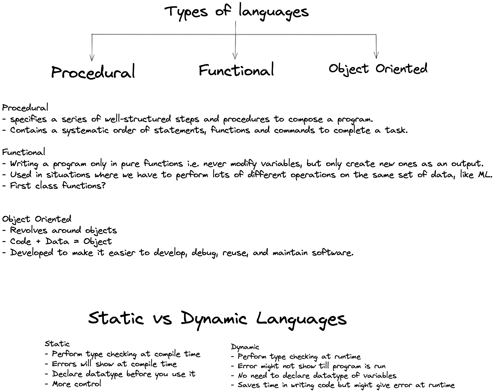

# __Intro To Programming Language__
Programming is way to instruct the computer to perform various task.

computer can understand only 0's and 1's 
instructiong in binary i.e. binary 0's and 1's are very difficult for humans to solve the issue we have programming languages. 
## **Programming Language :-**
- it is a computer language used by programmers 

```java
//human communication
Human1   --- >  Language     --- >      Human2
[speaks]       [english,hindi]        [Listens] 

//computer communication
Human   --- >       Java/Python       --- >     Computer 
[Written code]   [programming language]    [converts 0's and 1's]

```
- ## Types Of Programming Languages  

 
 - ### Static language Example

```java
class Main{
    public static void main(String[]args){
        int a = 5;//this type checking at complile time
        System.out.println(a);
        /*
        output: 
        5
        */
    }
}

```
- ### Dynamic lanuage Example 
```python
a = 2; #perform type checking at run time
print(a);
```
# Memory Management
- There are two Types of memory in Stack and Heap.
- When we declare a variable then the refrence variable is stored in stack memory points to the object of that variable stored in heap memory . 
> For Example : a=10 

```java
/*
- Objects are stores in Heap 
- Object refrence is stored in Stack
Stack Memory                     Heap Memory
-------------                 ---------------------
| a         | ----------->    | Integer object    |
|           |                 | Value: 10         |
-------------                  ---------------------

```
>For Example : int a = 10;

```java 
/* Primitves are stored in Stack

Stack Memory                Heap Memory
-------------               ---------------------
| Function Frame   |
|----------------- |                   
| a (int) = 10     |                   
|----------------- |
| (Other locals)   |
-------------------
```
```python
a = 10;
a = 20;
'''
step1:
a = 10;
Stack Memory                Heap Memory
-------------               ---------------------
| a       | ----------->    | Integer object    |
|         |                 | Value: 10         |
-------------               ---------------------

Step 2:-
a=20;
Stack Memory                Heap Memory
-------------               ---------------------
| a       | ----------->    | Integer object    |
|         |                 | Value: 20         |
-------------               ---------------------
                           |
                           |
                           ▼
                   ---------------------
                   | Integer object    |
                   | Value: 10         |
                   ---------------------


** Note :- The garbage collector will eventually clean up the heap memory used by 10, as no other references are pointing to it. **
'''
```
       